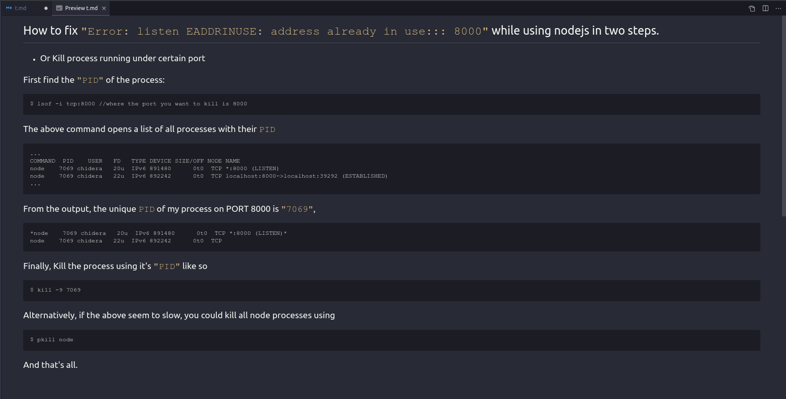

# How to fix `"Error: listen EADDRINUSE: address already in use::: 8000"` while using nodejs in two steps.



- ## Or Kill process running under certain port

## First find the `"PID"` of the process:

```
$ lsof -i tcp:8000 //where the port you want to kill is 8000
```

## The above command opens a list of all processes with their `PID`

```
...
COMMAND  PID    USER   FD   TYPE DEVICE SIZE/OFF NODE NAME
node    7069 chidera   20u  IPv6 891480      0t0  TCP *:8000 (LISTEN)
node    7069 chidera   22u  IPv6 892242      0t0  TCP localhost:8000->localhost:39292 (ESTABLISHED)
...
```

## From the output, the unique `PID` of my process on PORT 8000 is `"7069"`,

```
*node    7069 chidera   20u  IPv6 891480      0t0  TCP *:8000 (LISTEN)*
node    7069 chidera   22u  IPv6 892242      0t0  TCP
```

## Finally, Kill the process using it's `"PID"` like so

```
$ kill -9 7069
```

## Alternatively, if the above seem to slow, you could kill all node processes using

```
$ pkill node
```

## And that's all.

[Read on hashnode!](https://hashnode.com/post/how-to-fix-error-listen-eaddrinuse-address-already-in-use-8000-while-using-nodejs-in-two-steps-cjze638ie000btvs1erqztrbm)
