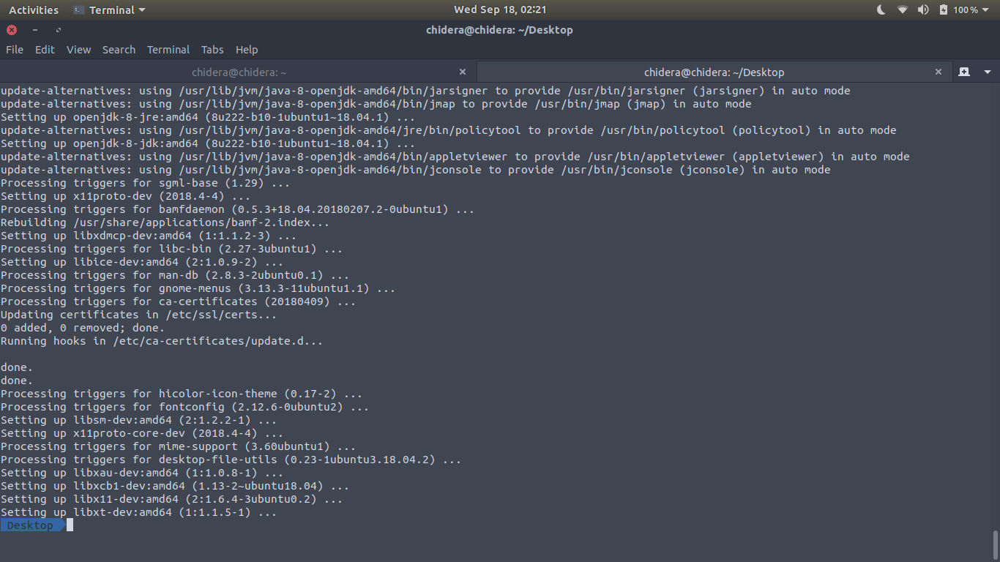
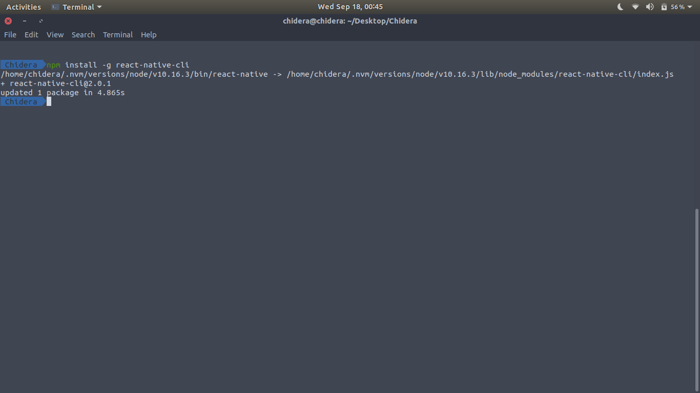
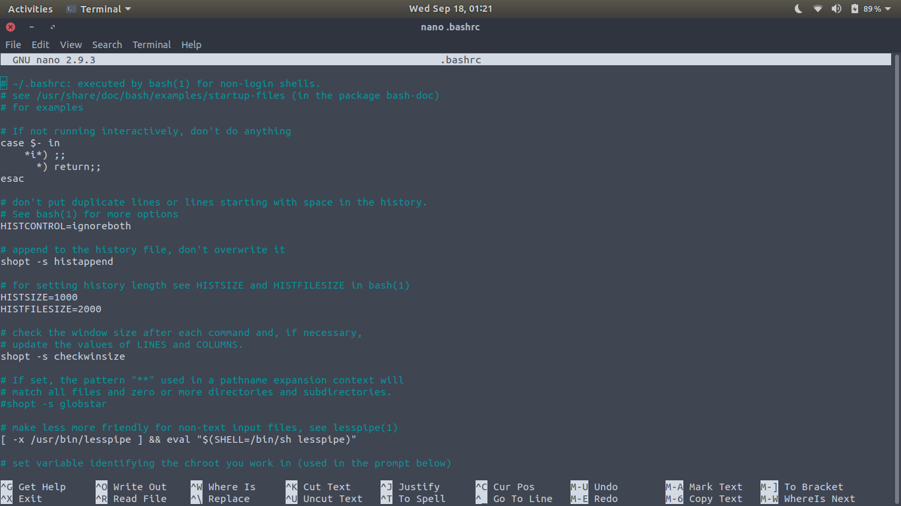
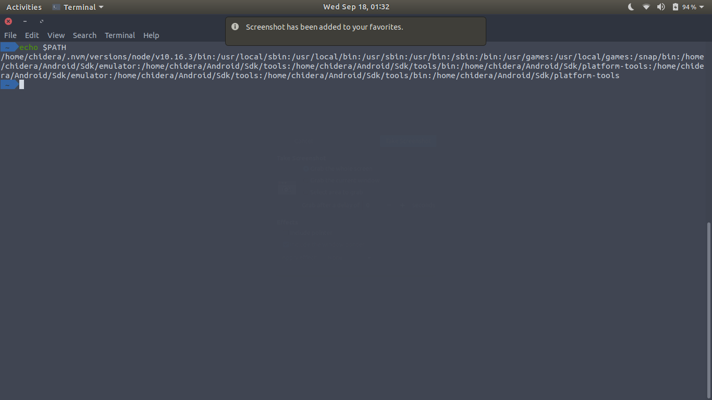
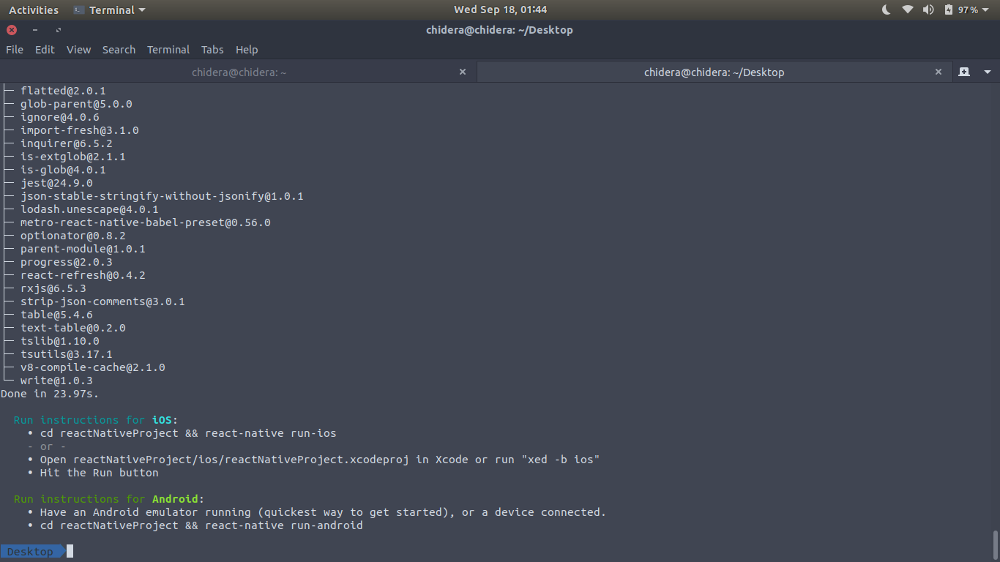

# INSTALL REACT NATIVE CLI AND RUN YOUR PROJECTS ON YOUR ANDROID PHONE

To install react native on linux you must have node and npm installed.

This how-to assumes you already have the Android SDK installed.
## Update your PC
```
$ sudo apt update
```

## Install open jdk
Do this using the following on the command line 
```
$ sudo apt install openjdk-8-jdk
```



## Install react Native CLI

Assuming you have node installed, the next step is to install the react native CLI. To do this, run the following code on your command line.
```
  $ npm install -g react-native-cli
```
On success, you should get this screen




## Android home environmental variables
If you're using bash as your shell, go to `$HOME/.bash_profile` or `$HOME/.bashrc` config file and add the following lines
```
export ANDROID_HOME=$HOME/Android/Sdk
export PATH=$PATH:$ANDROID_HOME/emulator
export PATH=$PATH:$ANDROID_HOME/tools
export PATH=$PATH:$ANDROID_HOME/tools/bin
export PATH=$PATH:$ANDROID_HOME/platform-tools
```

If you're using `ZSH`, it should be `$HOME/.zshrc`

To open `$HOME/.bashrc`, go to the terminal and type 
```
 $ nano .bashrc
```
and it should open a screen like so



Scroll to the bottom and add these lines of code

```
export ANDROID_HOME=$HOME/Android/Sdk
export PATH=$PATH:$ANDROID_HOME/emulator
export PATH=$PATH:$ANDROID_HOME/tools
export PATH=$PATH:$ANDROID_HOME/tools/bin
export PATH=$PATH:$ANDROID_HOME/platform-tools
```

When done, Press `ctrl + s` to save and `ctrl + x` to exit.

Next load the config file into your shell by typing the following on the command line
```
$ source $HOME/.bashrc
```

Comfirm that ANDROID_HOME has been added to your path by typing
```
$ echo $PATH
```
You should get this screen 



## Create a React Native App
If you got to this point, congrats. Next let's create a react native app on the desktop or any directory of your choice
```
Desktop$ react-native init reactNativeProject
```
On success, you should get this screen when you scroll down



## Run the react native app
First cd into your project
```
Desktop $ cd reactNativeProject
```
And run the following
```
$ react-native run-android
```

## Start the project

After running 
```
$ react-native run-android
```

the next thing is to

- enable USB debugging on your phone, and
- connect your phone to your PC, then run 

```
$ yarn start
```

This will start the project. 

