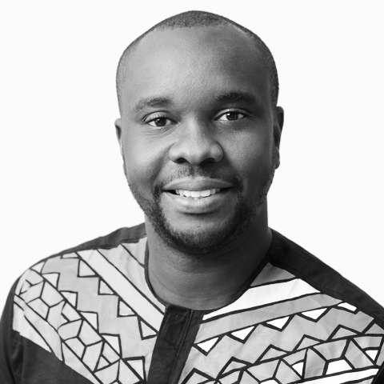

# Aniedi Udo-Obong

Aniedi Udo-Obong better known as the Nigerian [Google](https://www.google.com/)  Person is the [Google's](https://www.google.com/) Program Manager, Developer Ecosystem for Sub-Saharan Africa.

Before joining [Google](https://www.google.com/) in February 2016, he was the General Manager at Afro Technologies, having risen from the ranks of Chief Technology Officer through his significant role in revamping the company (April 2014 - February 2016).

In October 2012, he was the CEO of Audax Solutions(a technology, education and software development company). \
Prior to this time, he was in charge of Products, Technology and Development at Dragnet Solutions Limited, a computer-based Testing and Screening firm, where he was responsible for helping define & execute Product Strategy, Application Development, Technology Team Lead, Operations & Support.

He was also a Technology and Product Management Associate at Pegatech Limited a Fintech Company in Lagos Nigeria from February 2011 to January 2012. He worked as a web developer at Timbuktu Media Ltd, a print and online news publishing firm.

In His own words he describes himself as an "Experienced Program Manager with a demonstrated history of working in the internet industry. Skilled in Management, Networking, Software Development, Start-ups, and Project Management. Strong program and project management professional with a Bachelor of Engineering focused in Electrical/Electronics Engineering from University of Uyo."

Aniedi has had a wide array of experiences and through his role at [Google](https://www.google.com/) he has, in conferences, given several talks across the tech ecosystem of Sub Saharan Africa. He is Another great personality in the Industry with outstanding skills which include: Software development, Product Management, and Business Strategy.

His industry knowledge also includes Start-ups, Cloud Computing, Strategy, Mobile Devices, Management Consulting, Business Analysis, Business Development, Telecommunications, Web Development, Product Development, Open source, Team Leadership and Networking.

Social Contacts:

LinkedIn: [https://www.linkedin.com/in/aniediudo/](https://www.linkedin.com/in/aniediudo/),

Twitter: [https://twitter.com/aniediudo](https://twitter.com/aniediudo),

Website: [https://about.me/aniediudo](https://about.me/aniediudo)
