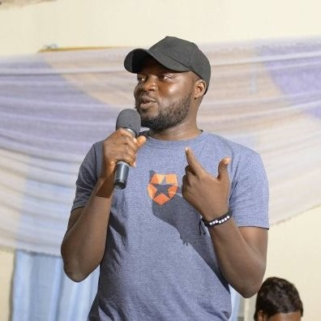

# David Daser

David Daser born October 30 is best known as the founder and CEO of nHub, the first software engineering firm in the Northern Nigeria.

In December 2018, he relegated his latter position as CEO when he was appointed the Director General of Plateau State Information Technology Agency (PSITA). In this position, he now manages the overall activities of PICTDA. Coordinate day to day operations of the agency. Works closely with decision makers in other arms of Government, Ministries, Agencies and Commissions to identify, recommend, develop, implement, and support cost-effective technology solutions for all aspect of Plateau State Government business activities and also coordinate ICT development in the state. Reporting directly to the Executive Governor to achieve the mandate of the Agency.

In June 2018, he became a "Member of the Council" of the Presidential Advisory Council on Technology and Creativity where he helps to provide a platform for an exchange of views on technology and creativity in a digital economy so as to promote coherence and fill existing policy gaps.

Prior to this time, in January 2016, he worked in the Plateau state ICT Agency, Working with the Plateau State Government in the formulation of Policy draft for the establishment of Plateau State Information & Communication Technology Development Agency.

He has also taken the role of a full time developer as an IT Consultant in Nigeria Airforce, Nigerian Defence Headquarters Abuja where he was the core developer of all software projects including advising on technology as well as deployment of anything tech. He stayed in this position from January 2012 to December 2014.

David Daser is a voice to be heard and listened to particularly because he knows his onions well and is a force to be reckoned with when it comes to tech related matters in the Nigerian ecosystem.
Before rising to such powerful ranks, he also worked in FrendTool Technologies Ltd and President Technologies.

In His own words he describes journey as "Software engineer by career, I have worked and consulted for top notch companies in the area of software development and outsourcing. I am currently focused at inspiring young people interested in picking up careers in tech and also working with governments at both state and federal level on policies and laws that would favour startups growth in Africa.

I am also engaged in building sustainable communities across the continent ranging from diverse tech communities as well as building advocacy communities that promote inclusiveness."

He completed his first degree in University of Jos with a BSc in Biochemistry with interests in BioInformatics (molecular modelling). While in school, he also participated in other tech related activities such as when he "Carried out research in Artificial intelligence, neural networks, fuzzy logic,operating systems, linux kernel,reverse engineering,data mining and datawarehousing."

David is a voracious learner with state of the art skills and endorsements including Software Development, Linux and PHP.
He has Industry knowledge in Programming, Web Development, Data Mining, and Computer Science with Tools and Technologies in his belt which include Java, MySQL, HTML, Open source, C#, Database, XML, Python, C++, and Visual Basic.

He speaks five(5) languages viz: English, French, Hausa, Mupun, and Yoruba. He has one Publication "Experience and Technology".

In December 2018, he was honoured and awarded as "The Best Young Information Communication Technologist (ICT)" in the Ten Outstanding Young Persons (TOYPS) Award of Excellence on the Plateau.

You can find him on linkedIn [https://www.linkedin.com/in/daser/]("https://www.linkedin.com/in/daser/").
