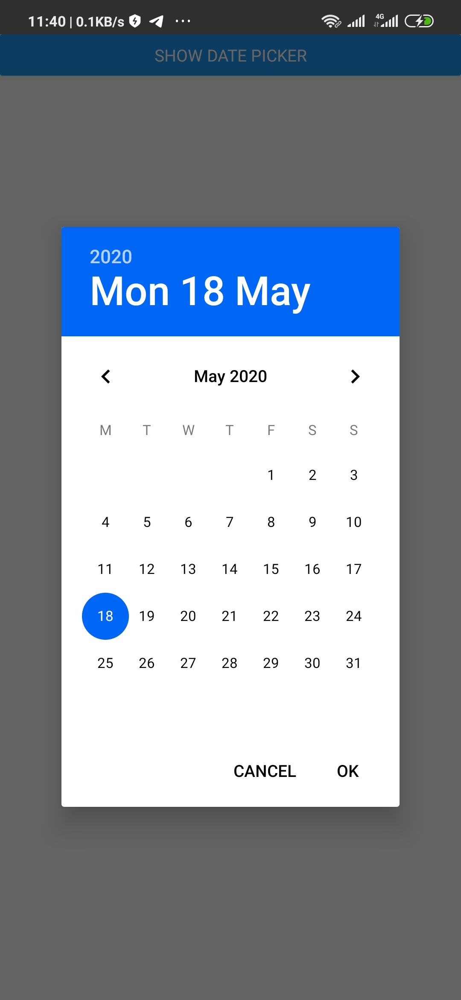

# Quickly Change background and text color of Android date time Picker in React Native

The android date time picker has a default background color of **green** and text color of black. While developing, it might become necessary for you to change the background color of the date time picker to match the color theme of your App. Say to a blue color.
Unlike other components, you can't accomplish that by using the default react native styling such as:

```js
style ={{backgroundColor: "blue"}} // this won't work
```

In this tutorial, I will show you how I was able to change the background color of the datetime picker to **blue**.

The full code can be found in this repo

Assuming you already have a react native project set up with `@react-native-community/datetimepicker` installed.
Go to::

```
/android/app/src/main/res/values/styles.xml
```

Replace the content with the following lines of code

```java
<resources>

   <!-- Base application theme. -->
<style name="AppTheme" parent="Theme.AppCompat.Light.NoActionBar">
    <!-- Customize your theme here. -->
    <item name="android:textColor">#000000</item>
    <item name="android:datePickerDialogTheme">@style/Dialog.Theme</item>
    <item name="android:timePickerDialogTheme">@style/Dialog.Theme</item>
</style>


<!-- Configuration for Dialog.theme. -->
<style name="Dialog.Theme" parent="Theme.AppCompat.Light.Dialog">
<!-- BackgroundColor of the date modal -->
    <item name="colorAccent">#0066F5</item>

   <!-- Change textColor of the date modal -->
    <item name="android:textColorPrimary">#000000</item>
</style>
</resources>
```

Rebuild and start your App with

```
$ yarn android && yarn start
```

Check and you should see the color change.



## Note

Be careful not to override the other styles that may have been added there by team mates if you're scaling a project. Such as styles for splash screen which you can find like so

```java
...
<style name="SplashTheme" parent="Theme.AppCompat.Light.NoActionBar">
  <item name="android:windowBackground">@drawable/background_splash</item>
  <item name="android:statusBarColor">@color/white</item>
</style>
```

If you have such styles, please don't override them but merge them together like this.

```java
<resources>

   <!-- Base application theme. -->
<style name="AppTheme" parent="Theme.AppCompat.Light.NoActionBar">
    <!-- Customize your theme here. -->
    <item name="android:textColor">#000000</item>
    <item name="android:datePickerDialogTheme">@style/Dialog.Theme</item>
    <item name="android:timePickerDialogTheme">@style/Dialog.Theme</item>
</style>


  <!-- Configuration for Dialog.theme. -->
<style name="Dialog.Theme" parent="Theme.AppCompat.Light.Dialog">
  <!-- BackgroundColor of the date modal -->
    <item name="colorAccent">#0066F5</item>
    <!-- textColor of the date modal -->
    <item name="android:textColorPrimary">#000000</item>
</style>

 <!-- Configuration for Splash screen. -->
<style name="SplashTheme" parent="Theme.AppCompat.Light.NoActionBar">
  <item name="android:windowBackground">@drawable/background_splash</item>
  <item name="android:statusBarColor">@color/white</item>
</style>
</resources>
```

For a hands-on step by step tutorial, follow this link
