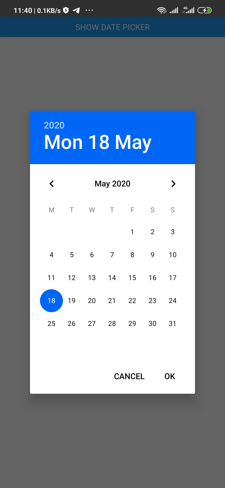

# Step by step guide on how to Change background and text color of Android date time Picker in React Native

In the previous tutorial here, we saw how we can quickly change the background color of the date time picker. This tutorial is for a more practical hands-on step by step tutorial on how to achieve the same result.

## Step 1

This tutorial is based on

```
"react": "16.11.0",
"react-native": "0.62.2"
```

The first step is to set up a react native project vis:

```
$ npx react-native init reactNativeTutorial
```

Once set up, cd into the project,

```
cd reactNativeTutorial
```

build and run the project

```
yarn android && yarn start
```

## Install the date time picker dependency

We will be using **react-native-modal-datetime-picker** which is based off of **@react-native-community/react-native-datetimepicker**.

We'll install it

```
# using yarn
$ yarn add react-native-modal-datetime-picker @react-native-community/datetimepicker

# using npm
$ npm i react-native-modal-datetime-picker @react-native-community/datetimepicker
```

- @react-native-community/datetimepicker package is a native module so it may require linking it using

```
$ react-native link
```

Rebuild and run the project.

Now go to your react native project, create a "src" folder. Create another "components" folder inside the src folder, next, insde the components folder create a file and call it "DateTimePicker.js".

```
reactNativeTutorial
  |_src
      |_components
                  |_DateTimePicker.js
```

We'll copy the example implementation from the [offficial **react-native-modal-datetime-picker**](https://github.com/mmazzarolo/react-native-modal-datetime-picker) docs and paste it inside `DateTimePicker.js` like so

```jsx
// DateTimePicker.js

import React, { useState } from "react";
import { Button, View, Text } from "react-native";
import DateTimePickerModal from "react-native-modal-datetime-picker";

const Example = () => {
  const [isDatePickerVisible, setDatePickerVisibility] = useState(false);

  const showDatePicker = () => {
    setDatePickerVisibility(true);
  };

  const hideDatePicker = () => {
    setDatePickerVisibility(false);
  };

  const handleConfirm = (date) => {
    console.warn("A date has been picked: ", date);
    hideDatePicker();
  };

  return (
    <View>
      <Button title="Show Date Picker" onPress={showDatePicker} />
      <DateTimePickerModal
        isVisible={isDatePickerVisible}
        mode="date"
        onConfirm={handleConfirm}
        onCancel={hideDatePicker}
      />
    </View>
  );
};

export default Example;
```

Go to App.js and paste this code

```jsx
import React from "react";
import { StyleSheet } from "react-native";
import DateTimePicker from "./src/components/DateTimePicker";
const App = () => {
  return <DateTimePicker />;
};

export default App;

const styles = StyleSheet.create({});
```

Reload the App and you should have this on your screen


When you click on the button, you should see the dateTimeModal but with a greenish color.


## Step 2

What we want to do is to change that **greenish** color to **blue**.
To achieve this, go to

```
/android/app/src/main/res/values/styles.xml
```

and replace the contents with the following code

```java
<resources>

   <!-- Base application theme. -->
<style name="AppTheme" parent="Theme.AppCompat.Light.NoActionBar">
    <!-- Customize your theme here. -->
    <item name="android:textColor">#000000</item>
    <item name="android:datePickerDialogTheme">@style/Dialog.Theme</item>
    <item name="android:timePickerDialogTheme">@style/Dialog.Theme</item>
</style>


  <!-- Configuration for Dialog.theme. -->
<style name="Dialog.Theme" parent="Theme.AppCompat.Light.Dialog">
  <!-- BackgroundColor of the date modal -->
    <item name="colorAccent">#0066F5</item>

    <!-- Change textColor of the date modal -->
    <item name="android:textColorPrimary">#000000</item>
</style>
</resources>
```

Rebuild and start your App with

```
$ yarn android && yarn start
```

Check and you should see the color change.



## Note

Be careful not to override the other styles that may have been added there by team mates if you're scaling a project. Such as styles for splash screen which you can find like so

```java
...
<style name="SplashTheme" parent="Theme.AppCompat.Light.NoActionBar">
  <item name="android:windowBackground">@drawable/background_splash</item>
  <item name="android:statusBarColor">@color/white</item>
</style>
```

If you have such styles, please don't override them but merge them together like this.

```java
<resources>

   <!-- Base application theme. -->
<style name="AppTheme" parent="Theme.AppCompat.Light.NoActionBar">
    <!-- Customize your theme here. -->
    <item name="android:textColor">#000000</item>
    <item name="android:datePickerDialogTheme">@style/Dialog.Theme</item>
    <item name="android:timePickerDialogTheme">@style/Dialog.Theme</item>
</style>


  <!-- Configuration for Dialog.theme. -->
<style name="Dialog.Theme" parent="Theme.AppCompat.Light.Dialog">
  <!-- BackgroundColor of the date modal -->
    <item name="colorAccent">#0066F5</item>

   <!-- Change textColor of the date modal -->
    <item name="android:textColorPrimary">#000000</item>
</style>

 <!-- Configuration for Splash screen. -->
<style name="SplashTheme" parent="Theme.AppCompat.Light.NoActionBar">
  <item name="android:windowBackground">@drawable/background_splash</item>
  <item name="android:statusBarColor">@color/white</item>
</style>
</resources>
```
