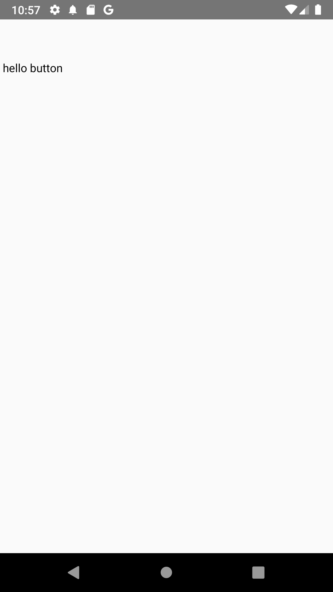
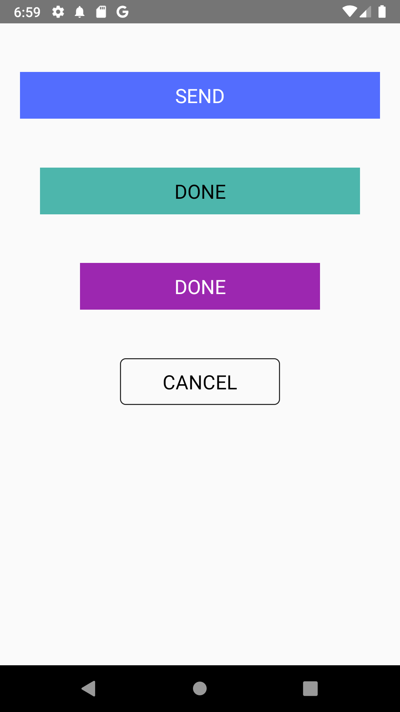

# Create a reusable custom button in React Native

[React Native](https://reactnative.dev) ships with a default button component which you can find [here](https://reactnative.dev/docs/button). A big con of this button is that it is not highly customizable. For this reason it becomes very necessary to create your own custom button component. 


We will be using the React Native's `TouchableOpacity` component to create our custom button component. This button will also accepts props.

First, 
- set up a new React native project; 
- create an `src` folder and add a `component` folder in inside it. 
- Create another folder inside the `component` folder and call it `CustomButton`.
- Inside `CustomButton`, add an index.js file. 

Your file structure should look like this

```
src 
	|components
			|CustomButton
				|index.js
```

Render the CustomButton in your App's index.js;

Add the following lines of code in the CustomButton's index.js file.

```js
// CustomButton/index.js
import React from 'react';
import {Text, StyleSheet} from 'react-native';

const CustomButton = () => {
  return (
		<View style={styles.container}>
      <Text> hello button </Text> 
		</View>
	);
};

export default CustomButton;

const styles = StyleSheet.create({
  container: {
    marginTop: 50,
  },
});

```




We'll use `TouchableOpacity` to replace the `View` component in the file,

```js
..
import {Text, TouchableOpacity StyleSheet} from 'react-native';
...
		<TouchableOpacity style={styles.container}>
      <Text> hello button </Text>
    </TouchableOpacity>
...
```
The `TouchableOpacity` receives `View` props plus another one called `onPress` which accepts a function.

```js
...
 <TouchableOpacity style={styles.container} onPress={() => console.log("Haha I'm about to be button")}> 
      <Text> hello button </Text>
```
With this, anytime we press the `hello button` text, we'll see a "Haha I'm about to be button" in the console, go ahead and try it.

Let's begin to style this button

```js
// Here I changed the text and added style prop
...
 <Text style={styles.title}> SEND </Text>
 ```

 Here's the new styling
```js
const styles = StyleSheet.create({
  container: {
    marginTop: 50,
    backgroundColor: '#512DA8',
    height: 48,
    alignItems: 'center',
    justifyContent: 'center'
  },
  title: {
      color: "#fff",
      fontSize: 16,
  }
});
```


Of course, you can add other stylings you deem fit.

Currently, our button is static, let's make it dynamic and reusable. That is, what if we want to change the title  from `SEND` to `CONTINUE`, what about the color of the button, and what if we want the button to do something else when pressed etc. 

To achieve this, we'll make the button accept a number of props
 - **title**: to change the button's title. It takes a `string` data type.
 - **onPress**: to pass in any function of choice. It takes a function.
 - **buttonColor**: to change the color of the button. It takes a `string` data type.
 - **titleColor**: to change the color of the title text. It takes a `string` data type.

 Also we'll add general styling prop in case we want to override the default styling for both `title` and `TouchableOpacity` we'll call them
- **buttonStyle**: It takes an object of styles.
- **textStyle**: It takes an object of styles.

Set up the props like this
```js
...
const CustomButton = ({
  title,
  onPress,
  buttonColor,
  titleColor,
  buttonStyle,
  textStyle,
}) => {
  return (
...
```
Then put them in their proper places

For **title** and **onPress** prop
```js
<TouchableOpacity
  style={styles.container}
	// Here
  onPress={onPress}
>
//Here too
  <Text style={styles.title}> {title} </Text>
...
```

So, for the `TouchableOpacity` we have
```js
...
<TouchableOpacity
// This here
      style={{...styles.container, ...buttonStyle, backgroundColor: buttonColor || '#512DA8' }}
      onPress={onPress}
>
...
```

and for the `Text` we have
```js
//This here too
...
<Text style={{...styles.title, ...textStyle, color: titleColor || "#fff"}}> {title} </Text>
...
```
> Notice how we  used a javascript [spread operator](https://developer.mozilla.org/en-US/docs/Web/JavaScript/Reference/Operators/Spread_syntax) to accomodate for many styles and we also added a default backgroundColor and text color for the button and the text respectively. They will act as fall back. 

Here's the current code 
```js
import React from 'react';
import {Text, TouchableOpacity, StyleSheet} from 'react-native';

const CustomButton = ({
  title,
  onPress,
  buttonColor,
  titleColor,
  buttonStyle,
  textStyle,
}) => {
  return (
    <TouchableOpacity
      style={{
        ...styles.container,
        ...buttonStyle,
        backgroundColor: buttonColor || '#512DA8',
      }}
      onPress={onPress}>
      <Text
        style={{...styles.title, ...textStyle, color: titleColor || '#fff'}}>
        {title}
      </Text>
    </TouchableOpacity>
  );
};

export default CustomButton;

const styles = StyleSheet.create({
  container: {
    marginTop: 50,
    backgroundColor: '#512DA8',
    height: 48,
    alignItems: 'center',
    justifyContent: 'center',
  },
  title: {
    color: '#fff',
    fontSize: 16,
  },
});

```

To take adavantage of these props, open App.js or anywhere you rendered the `CustomButton` component and add the following:

```js
...
    <>
      <CustomButton
        buttonColor="#536DFE"
        title="SEND"
        buttonStyle={{width: '90%', alignSelf: 'center'}}
        textStyle={{fontSize: 20}}
        onPress={() => console.log('I am the first button')}
      />

      <CustomButton
        buttonColor="#4DB6AC"
        titleColor="#000"
        title="DONE"
        buttonStyle={{width: '80%', alignSelf: 'center'}}
        textStyle={{fontSize: 20}}
        onPress={() => console.log('I am the second button')}
      />

      <CustomButton
        buttonColor="#9C27B0"
        titleColor="#FFF"
        title="DONE"
        buttonStyle={{width: '60%', alignSelf: 'center'}}
        textStyle={{fontSize: 20}}
        onPress={() => console.log('I am the third button')}
      />

      <CustomButton
        buttonColor="transparent"
        titleColor="#000"
        title="CANCEL"
        buttonStyle={{
          width: '40%',
          alignSelf: 'center',
          borderWidth: 1,
          borderColor: '#1c1c1c',
          borderRadius: 6,
        }}
        textStyle={{fontSize: 20}}
        onPress={() => console.log('I am the fourth button')}
      />
    </>
...
```

We'll get



That's it, you've succeeded in creating a reusable custom button in React Native.

> If you enjoyed this article please Like, share and add your comments.

> You can also follow me on [twitter](http://twitter.com/talk2dera)
