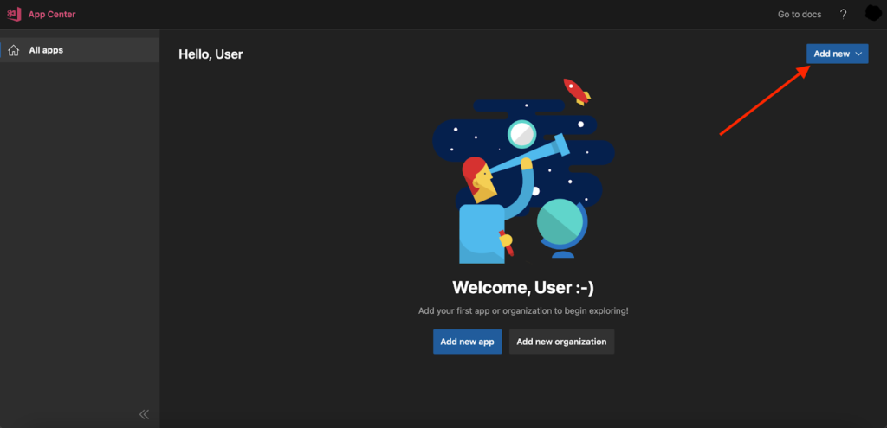
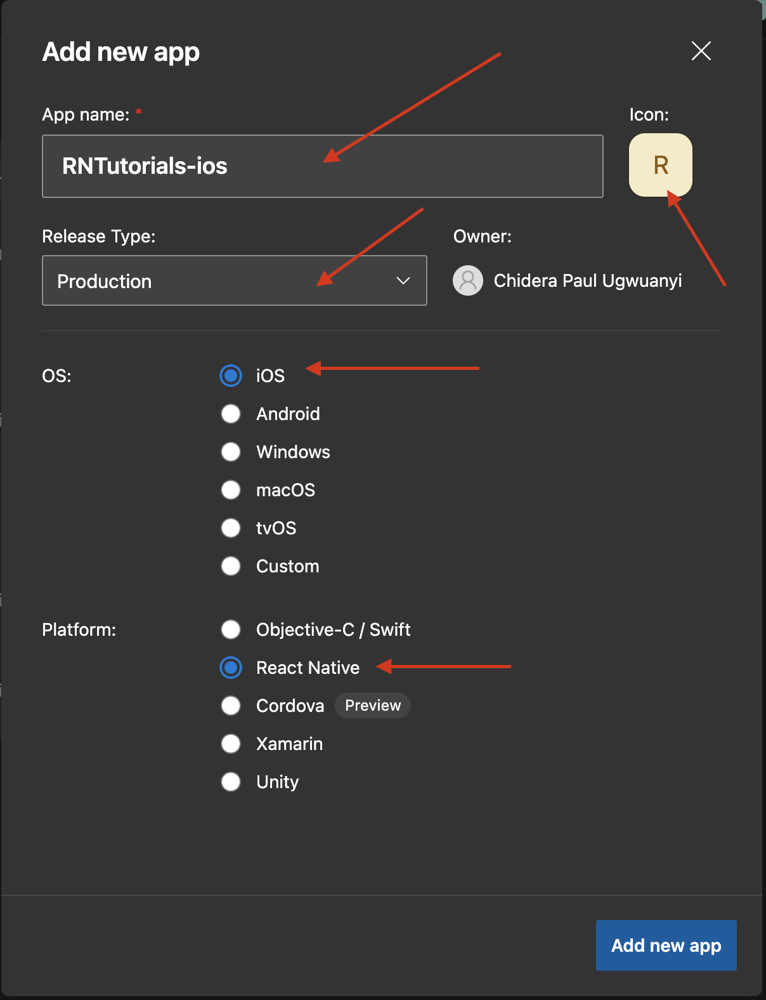
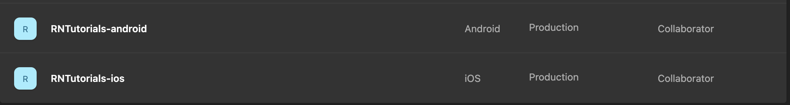
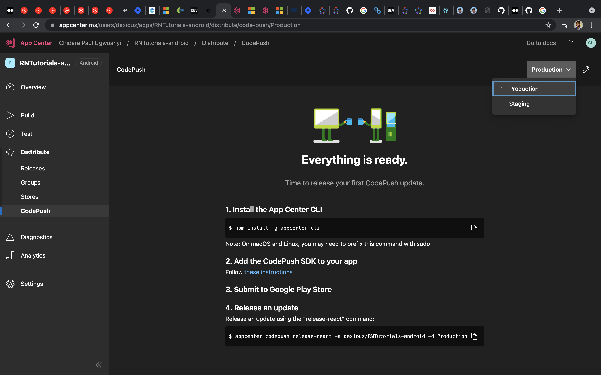
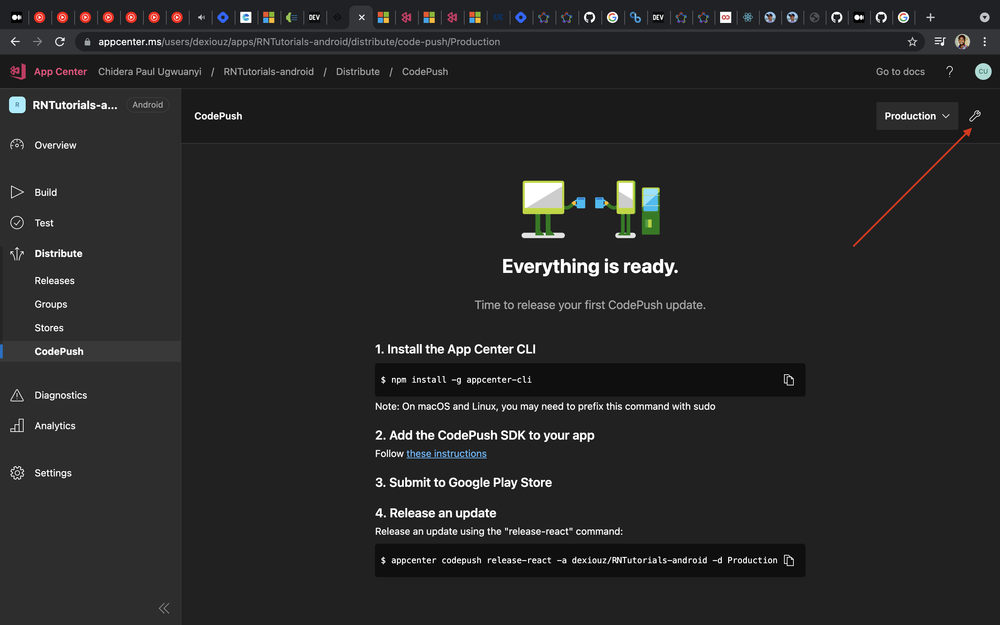
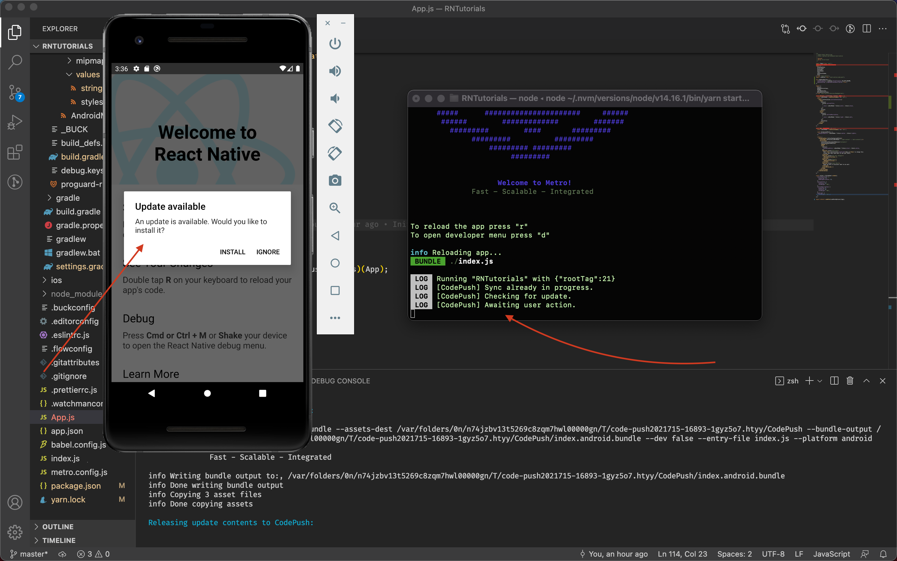
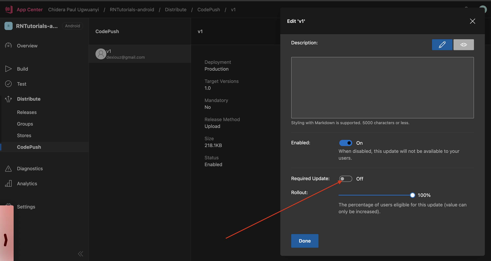
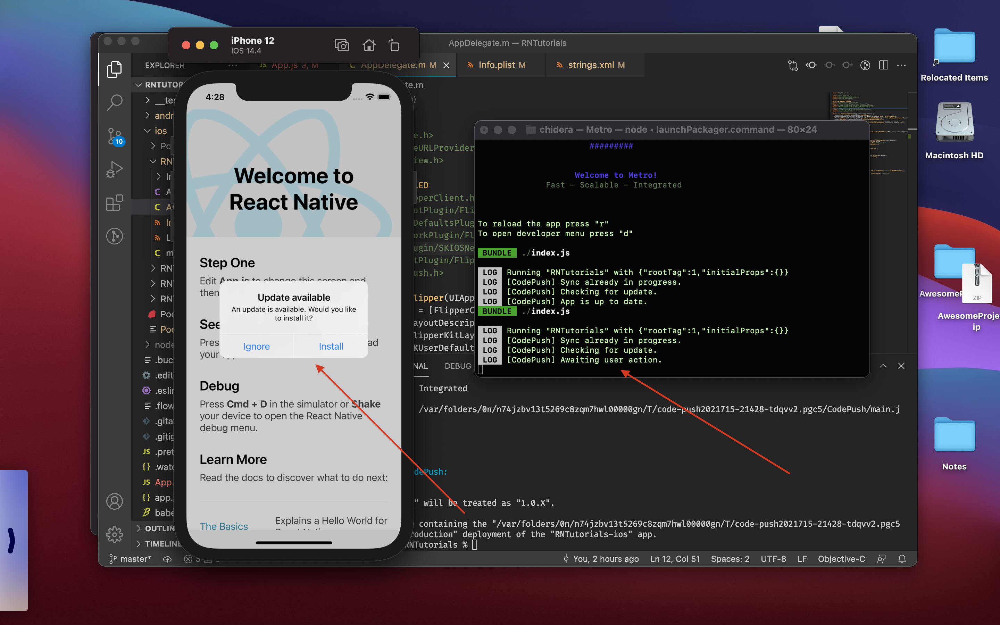

# Easily update your React Native App with Codeush.

## Why CodePush?

>The [CodePush service](https://github.com/microsoft/code-push), a part of [App center](https://appcenter.ms/) is a cloud service that enables Cordova and React Native developers to deploy mobile app updates directly to their users' devices.

> App center is Microsoft's solution for building, testing, distributing and monitoring apps all in the cloud.

(TLDR') There is something that happens when you start building mobile apps. You realize that at some point the owner of the project will want to see how far you have gone with the work. Unlike a web app where you could just send across a url to the client to check, for mobile(e.g android) you have to build what we call a release `apk` and send across to the client. Sometimes the apk can be upto 40mb+ in size.  What we usually do here is to upload the apk to Google drive and the client can download from there (Of course there are other fine-grained methods like hosting as beta in Playstore). 

The problem now is that for everytime you make a new change (e.g fix a typo, change colors) that the client wants to see, you have to make a fresh build, then upload to Google drive again. Consequently, the project owner has to uninstall the previous app from his phone and download the new build of say another 40mb+. And let's hope you didn't make another mistake else you have to start afresh. 

Another thing is that once the app is released via playstore(Android) or App store(ios), updating the JavaScript code (e.g., fixing bugs or adding new features) or image assets, requires recompilation and redistribution of the entire binary, which includes, of course, any review time associated with the store(s) on which it is published. Scary I must say.

In simple terms, what CodePush does for you is to ensure that the user doesn't have to delete his app and install a fresh 40mb App everytime, instead he is told that there's a new update and if he accepts it, the new/required change will be downloaded while he is still using the App. Only the size of the required change will be downloaded, say 3mb, 2kb etc and not the whole App of 40mb+.

Another beautiful thing about CodePush is that it maintains a copy of every version of the update you release. The advantage of this is that if you release a new update and that update crashes the app, you can roll back to the previous working update. 

There's so much but this is just a bit. I believe you get the big picture now. So let's see how we can integrate CodePush in our React Native App.

## Create a React Native project
If you already have a React Native project, that's fine else navigate to your directory of choice terminal and type
```sh
  $ npx react-native init RNTutorials
```
This creates a new React native project called `RNTutorials`. Ensure it runs etc for android and iOS.

## Create an App center account
Head over to [Microsoft Appcenter](https://appcenter.ms/create-account) to create a free account. Together with the CodePush service, App center provides other stuff such as building app binary (aab, apk, ipa)
, app distribution management, app testing on real devices, crash and usage analytics.

## Create your App in App Center
Once you are signed up and logged in to your dashboard, the next thing is to create your App in App center, your App can be either ios or android. 

From your dashboard, click the "`Add New`" button.



This opens a new page to create your App, we will be doing this twice, first for iOS, then for android.



 Fill the form like this for ios: 

- App name: Is your your app name, mine is `RNTutorials-ios`,
- Icon: Your app icon,
- Release Type: Select `Production`,
- OS: Select `iOS`,
- Platform: Select `React Native`,


Now click on `Add new app` button to complete the process. 

It will take you to the overview screen of the newly created app with information incase you want to add analytics and app center crashes. 

Go back to previous page or Click the `Add New` button again on the dashboard to create for android like so: 

- App name: Is your your app name, mine is `RNTutorials-android`,
- Icon: Your app icon,
- Release Type: Select `Production`,
- OS: Select `Android`,
- Platform: Select `React Native`,

Now click on `Add new app` button to complete the process. 

On your dashboard you should now see the newly created Apps.



Click on any of them, lets start with the android, so click on

> RNTutorials-android > Distribute > CodePush > Create standard deployments.

This way, App center will create two environments for you: Staging and production. For this guide, we will use Production.

Also go to ios App and do the same 

> RNTutorials-ios > Distribute > CodePush > Create standard deployments.



## Implement CodePush SDK in React Native client App

Install the appcenter-cli globally by running this on the command line

```sh
 $ npm install -g appcenter-cli
```

Now go to your app and install react native CodePush

```sh
# with npm
 $ npm install --save react-native-code-push

#  or with yarn 
yarn add react-native-code-push
```
After a successful global installation, you have to login to appcenter via terminal by runnning
```sh
appcenter login
``` 
- This will open a browser and generate a new API token.

- Copy the genrated token and paste in the same terminal where you are logging in.
- On success, you should see `Logged in as {Username}`

> Most React Native plugins usually have different integration process for Android and iOS. Let's go ahead and do the set up separately.

## Android Set up
From your app,

- Go to `android/settings.gradle` and add the following line of code;
```sh
include ':app', ':react-native-code-push'
project(':react-native-code-push').projectDir = new File(rootProject.projectDir, '../node_modules/react-native-code-push/android/app')
```
- Go to `android/app/build.gradle`, look for this piece of code 
```
apply from: "../../node_modules/react-native/react.gradle"
```
then add this one under it 
```
apply from: "../../node_modules/react-native-code-push/android/codepush.gradle"
```
Everything should now look like this:
```sh
...
apply from: "../../node_modules/react-native/react.gradle"
apply from: "../../node_modules/react-native-code-push/android/codepush.gradle"
...
```

- Go to `android/app/src/main/java/MainApplication.java`

First import the plugin class

```sh
    import com.microsoft.codepush.react.CodePush;
```
Then update here
```sh
    public class MainApplication extends Application implements ReactApplication {
    private final ReactNativeHost mReactNativeHost = new ReactNativeHost(this) {
        ...
        // 2. Override the getJSBundleFile method to let
        // the CodePush runtime determine where to get the JS
        // bundle location from on each app start
        @Override
        protected String getJSBundleFile() {
            return CodePush.getJSBundleFile();
        }
    };
}
```

-  Finally Let's add the `deployment key` to `android/app/src/main/res/values/strings.xml`

To get the deployment key, type this in the terminal
```sh
appcenter codepush deployment list -a <ownerName>/<appName> -k
```
Mine looks this way
```sh
appcenter codepush deployment list -a dexiouz/RNTutorials-android -k
```
You should have something like this
```sh
┌────────────┬───────────────────────────────────────┐
│ Name       │ Key                                   │
├────────────┼───────────────────────────────────────┤
│ Staging    │ opoGVuUethk2uZlFsWX5Oq1upZeSoiBLcYAjc │
├────────────┼───────────────────────────────────────┤
│ Production │ ZrgDzqIHGennFQ3fhDw3U915LmudyRcXSZswW │
└────────────┴───────────────────────────────────────┘
```
The deployment key lets CodePush know which runtime it should always query for (update from)  whether Staging or Production. We'll be using `production`. 

Another way to find the deployment key is to click the options icon on the CodePush dashboard at `yourApp/Distribute/CodePush`. it's at the top right corner, looking like a spanner haha. 



To make use of the Deployment key in `android/app/src/main/res/values/strings.xml`, create a new string called `CodePushDeploymentKey`, whose value is the key of the deployment you want to configure this app against (like the key for the Production deployment). 
Your `strings.xml` should look like this 
```sh
<resources>
    <string name="app_name">RNTutorials</string>
    <string moduleConfig="true" name="CodePushDeploymentKey">ZrgDzqIHGennFQ3fhDw3U915LmudyRcXSZswW</string>
</resources>
```


## Wrap your root component with CodePush. 

In my case,the root component is `App.js`. 

```jsx
// App.js
...
import codePush from "react-native-code-push";

let codePushOptions = { 
    checkFrequency: codePush.CheckFrequency.ON_APP_RESUME, 
    updateDialog: { appendReleaseDescription: true }
};

...
const App = () => {
    return (
        ...
    )
};

export default codePush(codePushOptions)(App);
```

Notice that we added "`codePushOptions`", You can check the list of codePushOptions [here](https://docs.microsoft.com/en-gb/appcenter/distribution/codepush/rn-api-ref#codepushoptions) . The option updateDialog: { appendReleaseDescription: true } means that the user gets update dialog when an update is available.

Now rebuild your app and check the metro logs and you should see something like this.
```
 LOG  Running "RNTutorials" with {"rootTag":1}
 LOG  [CodePush] Checking for update.
 LOG  [CodePush] Reporting binary update (1.0)
 LOG  [CodePush] App is up to date.
```
Awesome!

## Release an android version to CodePush

Do this by running
```
appcenter codepush release-react -a <owner_name>/<app_name> -d Production
```

In my case I did

```sh
appcenter codepush release-react -a dexiouz/RNTutorials-android -d Production
```

On process and completion, my terminal looked this

```sh
chidera@Chideras-MacBook-Pro RNTutorials % appcenter codepush release-react -a dexiouz/RNTutorials-android -d Production

Detecting android app version:

Using the target binary version value "1.0" from "android/app/build.gradle".

Running "react-native bundle" command:

node node_modules/.bin/react-native bundle --assets-dest /var/folders/0n/n74jzbv13t5269c8zqm7hwl00000gn/T/code-push2021715-16893-1gyz5o7.htyy/CodePush --bundle-output /var/folders/0n/n74jzbv13t5269c8zqm7hwl00000gn/T/code-push2021715-16893-1gyz5o7.htyy/CodePush/index.android.bundle --dev false --entry-file index.js --platform android
Welcome to Metro!
              Fast - Scalable - Integrated

info Writing bundle output to:, /var/folders/0n/n74jzbv13t5269c8zqm7hwl00000gn/T/code-push2021715-16893-1gyz5o7.htyy/CodePush/index.android.bundle
info Done writing bundle output
info Copying 3 asset files
info Done copying assets

Releasing update contents to CodePush:


Your target-binary-version "1.0" will be treated as "1.0.X".

Successfully released an update containing the "/var/folders/0n/n74jzbv13t5269c8zqm7hwl00000gn/T/code-push2021715-16893-1gyz5o7.htyy/CodePush" directory to the "Production" deployment of the "RNTutorials-android" app.
```
On success, go back to your App's CodePush dashboard in App center, reload and ensure your new release is there.

To confirm that everything works, run the App again, look at the metro server logs and notice that you can download the latest version from CodePush.



Once we click install, we get this on the metro server logs

```sh
 LOG  Running "RNTutorials" with {"rootTag":21}
 LOG  [CodePush] Sync already in progress.
 LOG  [CodePush] Checking for update.
 LOG  [CodePush] Awaiting user action.
 LOG  [CodePush] Downloading package.
 LOG  [CodePush] Installing update.
 LOG  [CodePush] Update is installed and will be run on the next app restart.
 ```

 It says the new update will be run on the next app restart. But if you want to run it on this same session instead of when you restart the App, then, click on the `Released update` on App center, click on the options icon, then check the "Required Update" button to true. Then click "Done".

 

## iOS Set up
For iOS set up do the following since you've installed react-native-codePush
```sh
cd ios && pod install && cd ..
```
From your app,
- Go to `ios/your-app-name/AppDelegate.m` and import codePush header

```sh
#import <CodePush/CodePush.h>
```
Still in `AppDelegate.m`, find this line of code 

```sh
return [[NSBundle mainBundle] URLForResource:@"main" withExtension:@"jsbundle"];
```

and replace it with 

```sh
return [CodePush bundleURL];
```

This change configures your app to always load the most recent version of your app’s JS bundle.

- Go to `ios/your-app-name/info.plist`

Remember that Deployment key?, let's get the one for iOS and  add it here.

We will make a new entry named `CodePushDeploymentKey`, whose value is the key of the deployment you want to configure this app against (in our case, it is Production).

To get the deployment key, type this in the terminal
```sh
appcenter codepush deployment list -a <ownerName>/<appName> -k
```
Mine looks like this
```sh
appcenter codepush deployment list -a dexiouz/RNTutorials-ios -k
```
You should have something like this
```sh
┌────────────┬───────────────────────────────────────┐
│ Name       │ Key                                   │
├────────────┼───────────────────────────────────────┤
│ Staging    │ Xheg3rfeO7VyKtEoGSRnRh3Lrh0lgwVs2j4rt │
├────────────┼───────────────────────────────────────┤
│ Production │ QbQuDUS4hSELnN4BMrVos1pWsvX6k6MnFFedc │
└────────────┴───────────────────────────────────────┘
```

The deployment key lets CodePush know which runtime it should always query for (update from)  whether Staging or Production. We'll be using `production`. 

Another way to find the deployment key is to click the options icon on the CodePush dashboard at `yourApp/Distribute/CodePush`. it's at the top right corner, looking like a spanner haha. 

Now add that key in `info.plist`
```sh
...
    <key>CodePushDeploymentKey</key>
	<string>QbQuDUS4hSELnN4BMrVos1pWsvX6k6MnFFedc</string>
...
```
Because we have wrapped our root component with CodePush, let's go ahead and re-build our ios App.
```sh
yarn ios
```
Check the metro server logs and we get

```
 LOG  Running "RNTutorials" with {"rootTag":1,"initialProps":{}}
 LOG  [CodePush] Sync already in progress.
 LOG  [CodePush] Checking for update.
 LOG  [CodePush] App is up to date.
```
## Release an iOS version to CodePush

Do this by running
```sh
appcenter codepush release-react -a <owner_name>/<app_name> -d Production
```
In my case I did

```
appcenter codepush release-react -a dexiouz/RNTutorials-ios -d Production
```

My terminal looks like this

```sh
chidera@Chideras-MacBook-Pro RNTutorials % appcenter codepush release-react -a dexiouz/RNTutorials-ios -d Production
Detecting ios app version:

Using the target binary version value "1.0" from "ios/rntutorials/Info.plist".

Running "react-native bundle" command:

node node_modules/.bin/react-native bundle --assets-dest /var/folders/0n/n74jzbv13t5269c8zqm7hwl00000gn/T/code-push2021715-21428-tdqvv2.pgc5/CodePush --bundle-output /var/folders/0n/n74jzbv13t5269c8zqm7hwl00000gn/T/code-push2021715-21428-tdqvv2.pgc5/CodePush/main.jsbundle --dev false --entry-file index.js --platform ios
Welcome to Metro!
              Fast - Scalable - Integrated

info Writing bundle output to:, /var/folders/0n/n74jzbv13t5269c8zqm7hwl00000gn/T/code-push2021715-21428-tdqvv2.pgc5/CodePush/main.jsbundle
info Done writing bundle output
info Copying 3 asset files
info Done copying assets

Releasing update contents to CodePush:


Your target-binary-version "1.0" will be treated as "1.0.X".

Successfully released an update containing the "/var/folders/0n/n74jzbv13t5269c8zqm7hwl00000gn/T/code-push2021715-21428-tdqvv2.pgc5/CodePush" directory to the "Production" deployment of the "RNTutorials-ios" app.
chidera@Chideras-MacBook-Pro RNTutorials % 
```

To confirm that everything works, run the App again, look at the metro server logs and notice that you can download the latest version from CodePush.



Once we click install, we get this on the metro server logs

```sh
 LOG  Running "RNTutorials" with {"rootTag":1,"initialProps":{}}
 LOG  [CodePush] Sync already in progress.
 LOG  [CodePush] Checking for update.
 LOG  [CodePush] Awaiting user action.
 LOG  [CodePush] Downloading package.
 WARN  Sending `CodePushDownloadProgress` with no listeners registered.
 LOG  [CodePush] Installing update.
 LOG  [CodePush] Update is installed and will be run on the next app restart.
```
It says the new update will be run on the next app restart. But if you want to run it on this same session instead of when you restart the App, then, click on the `Released update` on App center, click on the options icon, then check the "Required Update" button to true. Then click "Done".

 

You can check your ios release if you go to

 `yourapp/Distribute/CodePush/Production(From the options icon - top right)`.

And that's it. Congratulations, you have succeeded in setting up CodePush service in your React Native App.

> If you found this article useful please like , drop your comments and share with your friends. 
> You can also Follow me on twitter:  [@talk2dera](https://twitter.com/talk2dera) 


