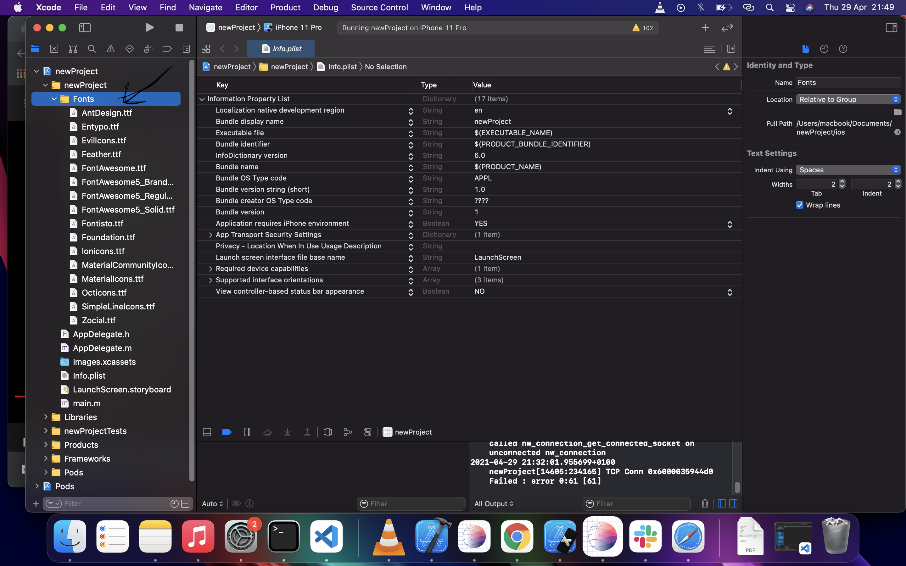
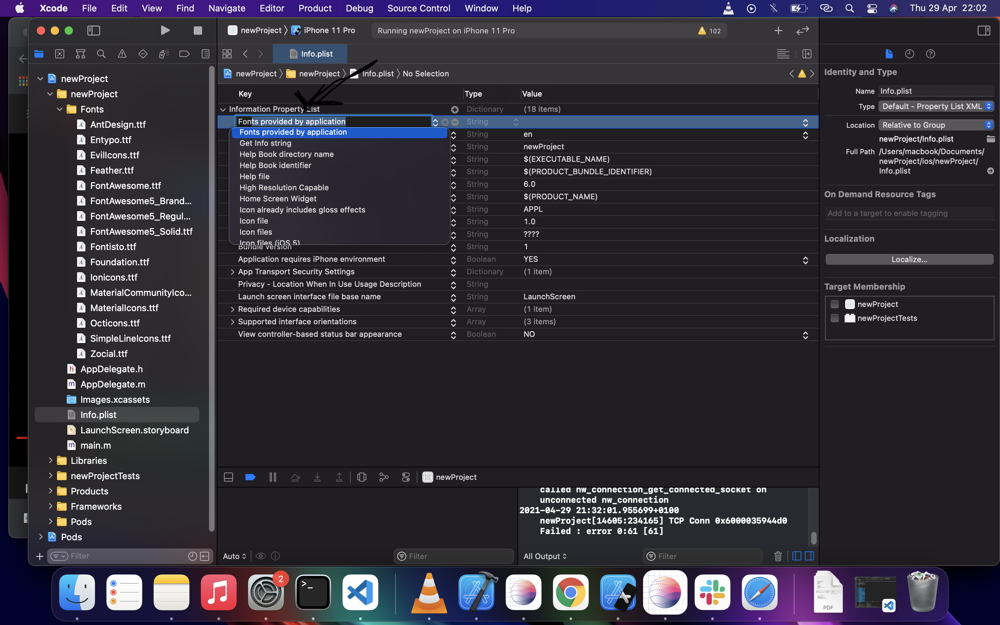
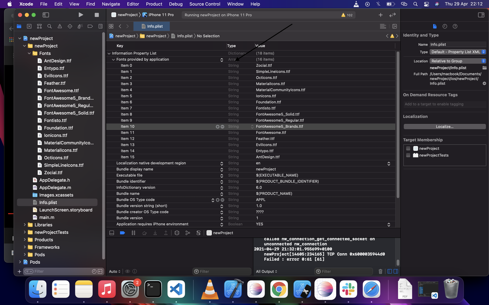
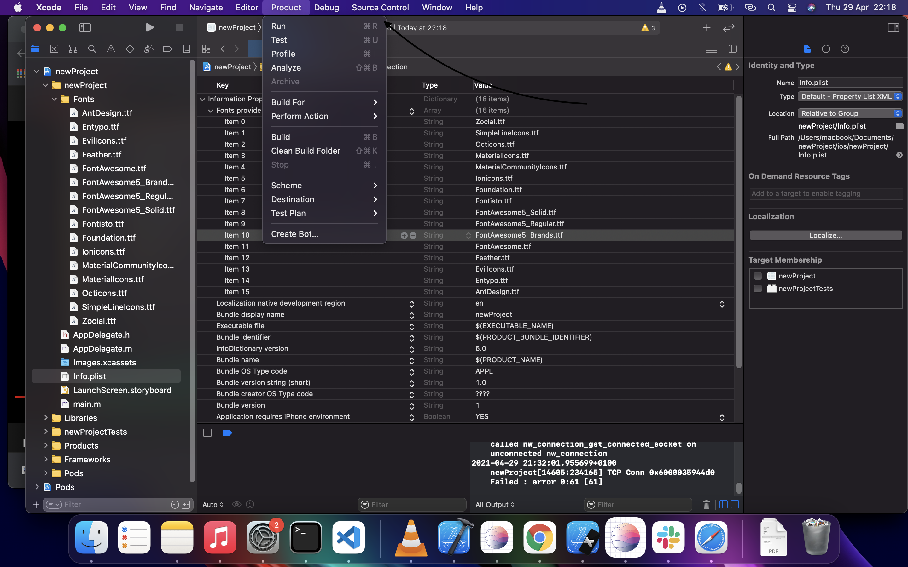

# Set up [React Native Vector Icons](https://github.com/oblador/react-native-vector-icons) for iOS

I will create a React Native project and call it `newProject`.
```
$ npx react-native init newProject
```

Install [React Native Vector Icons](https://github.com/oblador/react-native-vector-icons) into the project.

```sh
$ yarn add react-native-vector-icons
```

Or using npm

```sh
$ npm install react-native-vector-icons
```
Open the project in Xcode by going into the project root folder and running `xed ios`

```
$ cd newProject
```
then
```
$ xed ios 
```

The above code should open your project in Xcode.

You'll see two folders in xcode vis:
- newProject
- Pods

"`newProject`" is the name of my project.

Open `newProject` folder, you'll see another `newProject` folder, open it too to expose
- AppDelegate.h

- ...

- main.m

There, right click on the newProject folder and click on 'New Group' to create a new group called 'Fonts'.

In `Finder`, Open `node_modules` of `newProject` and scroll down to `react-native-vector-icons`.

Inside, you'll see `Fonts` folder, open it. Select all the fonts with `ctrl + A` then drag all the fonts there to the "Fonts" group you recently created in xcode. A good way to do this is to keep both side by side.

Once you drag them there you'll see a pop up, ensure you check the "Copy items if needed" option. Click "Finish" and that should be all, it should now populate the "Fonts" group with the icons.



### Add Fonts to info.plist

Still inside "newProject" in xcode, you'll see `info.plist`, it's on the same level with "Fonts". Click on it.

Next click on the `+` button that is on the `Information Property List`. The button comes up when you hover over the `Information Property List`. It will create a new input, add this to it "Fonts provided byapplication". 



Now start adding all your fonts to "Fonts provided byapplication". Using the `+` button on it to create new input file and paste the name of each font. You can copy the name of the fonts from the mode_modules holding react-native-vector-icons.

As a reference, here's all the fonts

```
Zocial.ttf
SimpleLineIcons.ttf
Octicons.ttf
MaterialIcons.ttf
MaterialCommunityIcons.ttf
Ionicons.ttf
Foundation.ttf
Fontisto.ttf
FontAwesome5_Solid.ttf
FontAwesome5_Regular.ttf
FontAwesome5_Brands.ttf
FontAwesome.ttf
Feather.ttf
EvilIcons.ttf
Entypo.ttf
AntDesign.ttf
```




If you were initially running the react native with "yarn start" or "npm start", stop it with `ctrl + c`.

Run 
```
$ npx pod-install
```

 or cd into ios and run 
 ```
 $ pod install
 ```

 Next go back to xcode and click on `product`. It's at the top menu, when it opens, select "Clean Build Folder"

 

 Now run your project either through xcode or through terminal with yarn start or npm run start.

In my case, I had to run 
```
$ yarn ios
```
or 
```
$ react-native run-ios
```

before running 

```
$ yarn start
```

to get the icons to show up.
