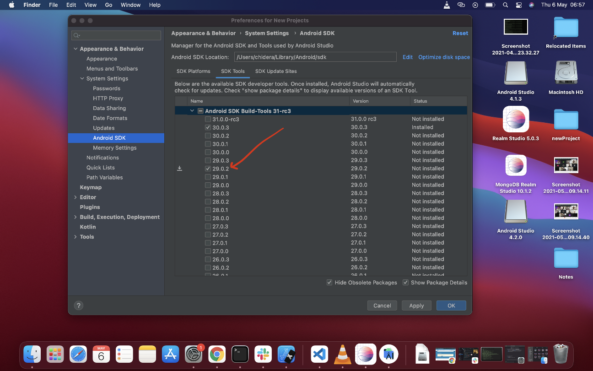

# How to Set up React Native on MacOS

So you have a new MacOS and now you want to set up [React Native](https://reactnative.dev/) on your new machine. This guide will walk you through with a straight to the point approach. No gimmicks. 


We'll divide our set up into three
- General( For all platforms both iOS and Android)
- iOS Specific and
- Android Specific

## General
## [Homebrew](https://brew.sh)
The first thing is to ensure you have [Homebrew](https://brew.sh/) installed by typing:
```sh
 $ brew --version
```
if you get ```zsh: command not found: brew```, then it means you don't have it installed.

Install Homebrew with:
```sh
/bin/bash -c "$(curl -fsSL https://raw.githubusercontent.com/Homebrew/install/HEAD/install.sh)"
```
It will prompt for sudo password(your mac/laptop password), enter it to proceed.

Then you should see this too
```sh
...
==> The Xcode Command Line Tools will be installed.

Press RETURN to continue or any other key to abort
```
Just press enter and continue

After installation, check your brew version by typing 
```sh
$ brew --version
```
A succesful installation should output

```sh
$ Homebrew 3.1.3
Homebrew/homebrew-core (git revision 036b0409ce; last commit 2021-04-27)
```

## [Node](https://nodejs.org/en/)
Next we have to install [node](https://nodejs.org/en/). 
I prefer to install node via nvm(node version manager). With nvm, I can install and use any version of node at anytime.:

### Install nvm
Run this on the terminal
```sh
$ curl -o- https://raw.githubusercontent.com/nvm-sh/nvm/v0.35.3/install.sh | bash
```

Once completed, close your terminal, reopen it and type:
```
$ nvm ls
```

If you get this error
```
....
 Profile not found. Tried ~/.bashrc, ~/.bash_profile, ~/.zshrc, and ~/.profile.
...
```

Then do this
```
$ touch ~/.bash_profile  
```
Again, close your terminal, reopen it and type:
```
$ nvm ls
```

If you get the error
```
zsh: command nvm not found
```

Then type this:
```
$ source ~/.nvm/nvm.sh 
```
This should fix it.

Running this again
```
nvm ls
```
should now output something like this

```sh
            N/A
iojs -> N/A (default)
node -> stable (-> N/A) (default)
unstable -> N/A (default)
nvm_list_aliases:36: no matches found: /Users/chidera/.nvm/alias/lts/*
```
This shows it has been installed successfully

### Install node via nvm 
To see a list of  installable node versions, type this
```
nvm ls-remote
```

which should output
```
...
       v14.16.1   (Latest LTS: Fermium)
        v15.0.0
        v15.0.1
        v15.1.0
...
```
At the time of this writing, `v14.16.1 is the Latest stable version` so we install it

```
$ nvm install 14.16.1
```
Once completed, we use it like so:
```
nvm use 14.16.1
```

Let's confirm the node version installed 
```
node --version
```
which outputs
```
14.16.1
```
Since npm comes with node, we also check it's installed version
```
npm --version
```
which outputs
```
6.14.12
```

### [Install Yarn](https://classic.yarnpkg.com/en/docs/install/#mac-stable)
This is not compulsory as you can use `npm` for the same purpose, however, I personally just like using yarn.

```
$ npm install --global yarn
```

## [Watchman](https://facebook.github.io/watchman/)
Watchman is to watch specific folders or files, and if they are changed, it can trigger some actions.

Install watchman
```
$ brew update
$ brew install watchman
```
After installation, confirm watchman by
```
$ watchman --version
```

## iOS
### [XCode](https://developer.apple.com/xcode/)
Install the mpre than 10GB+ XCode via the [Mac App Store](https://apps.apple.com/us/app/xcode/id497799835?mt=12). When the page opens, click on "View in Mac App Store" or click on "Open App Store" in the ensuing pop up.
Installing Xcode will also install the iOS Simulator and all the necessary tools to build your iOS app.


### Configure Command Line Tools
To configure command line tools after installation of xcode, execute/open xcode, then from the xcode menu at the top left corner of your Mac, click on the `Xcode -> Preferences`. Once inside, you'll see a list of tab arranged menu, click "Locations". 

Once inside `Locations`, you'll see `Command Line Tools`, click on the input there and select the most recent, mine was `Xcode 12.5 (12E262)`. Input your password when prompted.

### [Install Cocoapods]( https://cocoapods.org/)

Cocoapods is the dependency manager on iOS development.
Install it with 
```
$ sudo gem install cocoapods
```


After installation, check your pod version
```
$ pod --version
```

**That's it for iOS installation, let's confirm it's working.**

## React Native Command Line Interface
Rather than install and manage a specific version of React Native CLI globally, it's recommended to access the current version at runtime using `npx`.

Let's create a new React Native project. First `cd` into any Directory of your choice. I'll use Desktop
```
$ cd Desktop
```
Then run the following
```
$ npx react-native init newProject
```
```
$ npx pod-install
```
```
$ yarn ios
```

<!--  -->
## Android
### [Install JDK]()
Install Java Development Kit (JDK) using Homebrew with the following command:
```
$ brew install --cask adoptopenjdk/openjdk/adoptopenjdk8
```
After installation, run this for confirmation
```
$ java -version
```
This should output
```
openjdk version "1.8.0_292"
OpenJDK Runtime Environment (AdoptOpenJDK)(build 1.8.0_292-b10)
OpenJDK 64-Bit Server VM (AdoptOpenJDK)(build 25.292-b10, mixed mode)
```

Java compiler comes installed with JDK, confirm this by
```
$ javac --version
``` 
Which shows 
```
javac 1.8.0_292
```

### [Android Studio](https://developer.android.com/studio)
Android Studio is used to develop Android Applications on Mac.
 Follow this [link](https://developer.android.com/studio) to download it.

 ### Configure Android Studio
After downloading, the next thing is to configure Android studio. 
Double click the Android studio file in your downloads folder, after installation, you'll see a screen with the Android studio and Applicaations folder, drag the Android studio into the Applications folder.


Now go to Applications and execute it.

It opens with two options: 
- Config or Installation folder
- Do not import settings

Select the "Do not import Settings" and click 
Ok if you've not previously installed Android studio or do not intend to keep any previous settings


This should bring you to the welcome page


Click on next to go to the next page


Select `Custom` and click `Next`


In this new page where it sets the path, click next and select preferred theme in the next page. 
I selected the Dracular dark theme


The next screen is the Android SDK setup components screen.

Ensure that `Performance (Intel ® HAXM)` option and `Android Virtual Device option` are selected then click Next button.


This takes you to the next screen, click Next without altering anything,


The final screen is this that shows the summary of the downloads it is about to make, click `Finish` to start the download


Once the download completes, click `Finish` on the next screen


### Android SDK Configurattion
The next phase is now about SDK configuration. On the next screen, click on `Configure` on the right botton and select `SDK Manager` 


_- The SDK Manager can also be found within the Android Studio "Preferences" dialog, under Appearance & Behavior → System Settings → Android SDK._

On the next screen click on `Show Package Details` at the bottom right


Then select the following, ensuring you're on the `SDK Platforms` tab: 

- Android SDK Platform 29
- Intel x86 Atom_64 System Image `or` Google APIs Intel x86 Atom System Image


Still on same screen, select `SDK Tools` tab and check the box next to `"Show Package Details"` here as well. Look for and expand the `"Android SDK Build-Tools"` entry, then make sure that `29.0.2` is selected and check the `"Android SDK Command-line Tools (latest)"`.



Finally, click "Ok" then click "Ok" on the next summary page, also accept the "License Agreement terms and conditions" then click on "Next" to download and install the Android SDK and related build tools.

Once it's finished downloading and unzipping, click `Finish`


###  Configure the ANDROID_HOME environment variable

What we want to do is to open `$HOME/.bash_profile` or `$HOME/.bashrc` to add environmental variables. If you’re using `ZSH`, it should be `$HOME/.zshrc`.
To open `$HOME/.bashrc` or `$HOME/.zshrc`, go to the terminal and type 
```
$ vim ~/.zshrc
```  
if you're using `bash` it should be 

```
$ vim ~/.bashrc
```
It should open this vim page

```
export NVM_DIR="/Users/chidera/.nvm"
[ -s "$NVM_DIR/nvm.sh" ] && . "$NVM_DIR/nvm.sh"  # This loads nvm
~
~
~
~    
"~/.zshrc" 3L, 104B
```

From your keyboard, click `i` to edit `vim` and you should get this
```
export NVM_DIR="/Users/chidera/.nvm"
[ -s "$NVM_DIR/nvm.sh" ] && . "$NVM_DIR/nvm.sh"  # This loads nvm
~
~
~
~    
-- INSERT --
```

Copy and paste this code inside there
```
export ANDROID_HOME=$HOME/Library/Android/sdk
export PATH=$PATH:$ANDROID_HOME/emulator
export PATH=$PATH:$ANDROID_HOME/tools
export PATH=$PATH:$ANDROID_HOME/tools/bin
export PATH=$PATH:$ANDROID_HOME/platform-tools
```
And you should get this

```
export NVM_DIR="/Users/chidera/.nvm"
[ -s "$NVM_DIR/nvm.sh" ] && . "$NVM_DIR/nvm.sh"  # This loads nvm
export ANDROID_HOME=$HOME/Library/Android/sdk
export PATH=$PATH:$ANDROID_HOME/emulator
export PATH=$PATH:$ANDROID_HOME/tools
export PATH=$PATH:$ANDROID_HOME/tools/bin
export PATH=$PATH:$ANDROID_HOME/platform-tools
~
~
~
~                                                                                    
-- INSERT --
```

When you're done, press `esc` key, then press `:wq` + `Enter` to save your changes and that should be all.

### Start React Native App
Go to the where you initialised a React Native App and in it's terminal, run 
```
$ yarn android
```
Or 
```
$ react-native run-android
```

Give it sometime to build and if successful, you should get your emulator up and running


You can also run your project from ios simulator


Congratulations!!! You've succeeded in setting up React Native on your MacBook to run both iOS and Android OS.